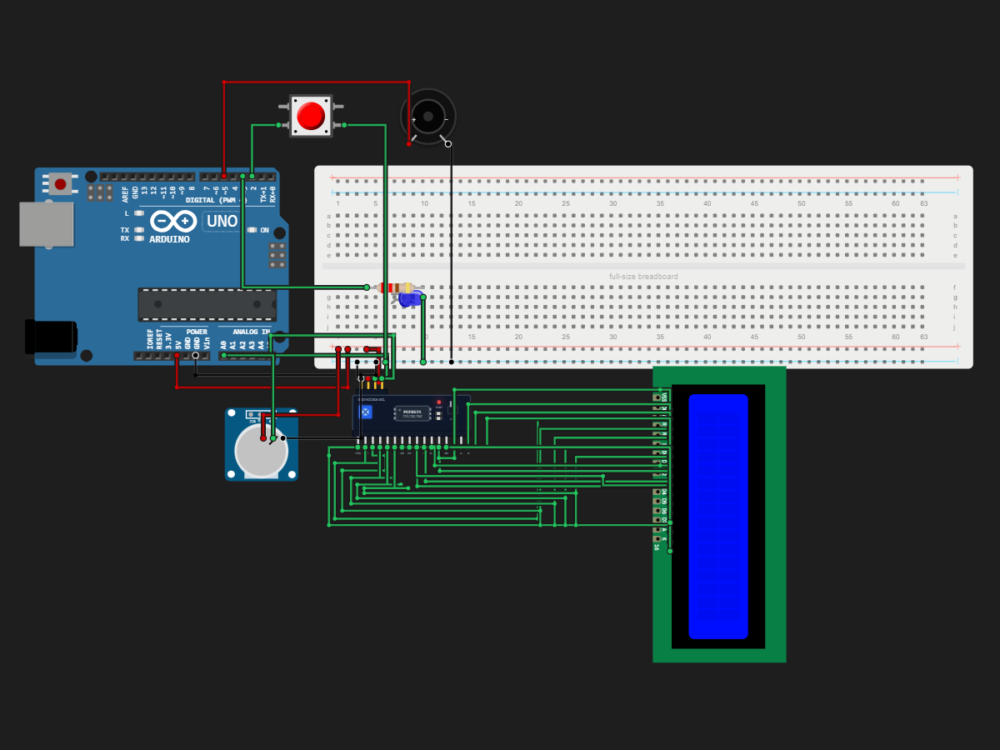

# Timer Display!!!

> Built in [Breadboard](https://breadboard.hackclub.com), a Hack Club program. This project took ~3 hours of work.

## What It Does

Simple Timer Display! You can use a knob to change the length of the timer and press the button to stop/start. There is also an LED that blinks when the timer is active. I hope you enjoy this <333

## How It Works

The circuit is captured in `breadboard-project.json`, and the firmware that runs it is in the `firmware/` folder.

## How To Use It

This is a simple timer display! You can turn the knob to change the timer's length, and you can press the button to start and stop the timer. Unfortunately, there is no pause button currently, :( but there is a buzzer that will notify you when the timer is done. Also, an LED will blink when the timber is being used.

## Demo

- **Simulate it live:** [https://breadboard.hackclub.com/share/155](https://breadboard.hackclub.com/share/155), runs the firmware in the Breadboard simulator
- **View the design:** [https://taniwankenobi.github.io/breadboard-plays/p/155/](https://taniwankenobi.github.io/breadboard-plays/p/155/)

## Schematic

The editor snapshot is in `breadboard-project.json`.

## Bill of Materials

| Part | Quantity |
| --- | --- |
| breadboard-full | 1 |
| buzzer-passive | 1 |
| lcd1602 | 1 |
| lcd1602-i2c | 1 |
| led-blue | 1 |
| potentiometer | 1 |
| pushbutton | 1 |
| resistor-220 | 1 |

## Firmware

Firmware files are in the `firmware/` folder.

## Build Journal

Build journal entries are kept in [`journals.md`](journals.md).

---

*Made in [Breadboard](https://breadboard.hackclub.com) — 3h of work*

